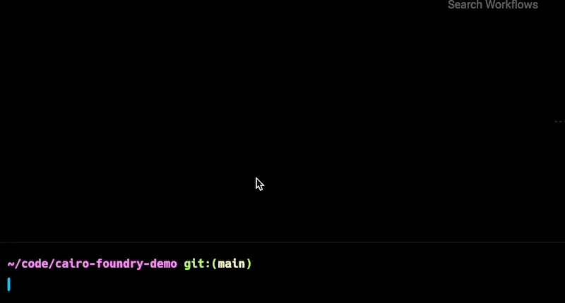

# Cairo-foundry demo

This is a sample project to demo the [Cairo-foundry]() test runner.



## Benchmark

This repo contains tests written both for protostar and cairo-foundry.

### Protostar timings

```
$ time protostar test

14:51:55 [INFO] Collected 1 suite, and 2 test cases (0.078 s)
[PASS] tests_with_protostar/test_main.cairo test_failing_array_sum (time=1.44s)
[PASS] tests_with_protostar/test_main.cairo test_array_sum (time=0.03s, steps=48)

14:51:59 [INFO] Test suites: 1 passed, 1 total
14:51:59 [INFO] Tests:       2 passed, 2 total
14:51:59 [INFO] Seed:        3650489123
14:52:00 [INFO] Execution time: 6.05 s

________________________________________________________
Executed in    6.37 secs    fish           external
   usr time   16.41 secs    0.04 millis   16.41 secs
   sys time    2.08 secs    1.05 millis    2.07 secs
```

### Cairo-foundry timings

```
$ time cairo-foundry test --root test_with_cairo_foundry

Running tests in file test_with_cairo_foundry/test_sum.cairo
[OK] test_array_sum (508.583µs)

[OK] test_failing_array_sum (567.166µs)


________________________________________________________
Executed in  495.52 millis    fish           external
   usr time  420.87 millis    0.04 millis  420.83 millis
   sys time   56.44 millis    1.11 millis   55.33 millis
```

### Comparison

| Measurement         | Protostar | Cairo-foundry | Improvement |
| ------------------- | --------- | ------------- | ----------- |
| Global test command | 6.37s     | 495ms         | 12.8x       |
| Slowest test        | 1.44s     | 567µs         | 2500x       |
| Quickest test       | 0.03s     | 508µs         | 59x         |
| Average test        | 0.73s     | 537µs         | 1350x       |
